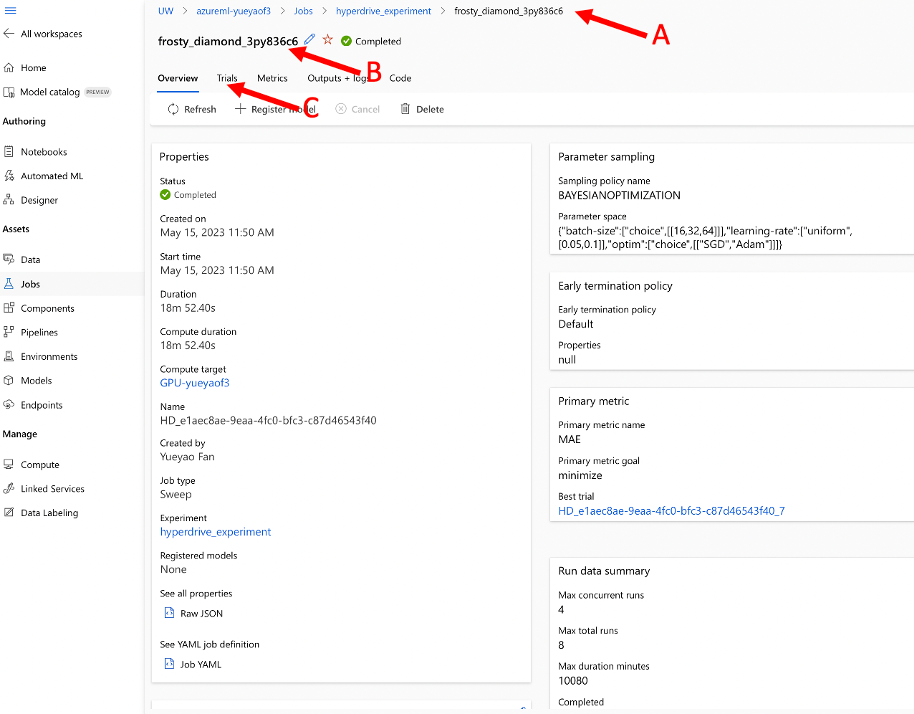
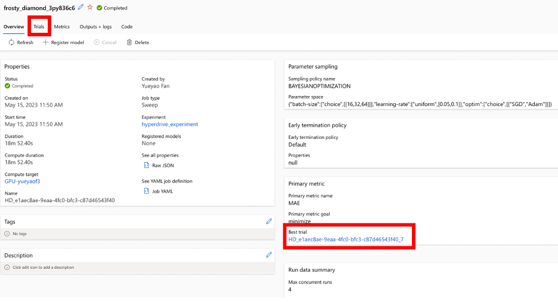
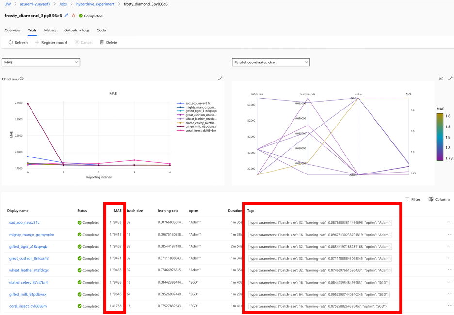
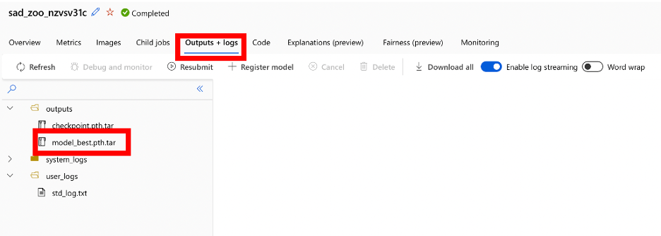

# MSE544-HyperDrive Experiment

Yiyang Ling, Alexis Mills, Luna Yue Huang 

## HyperDrive
HyperDrive is a machine learning package found within Azure that aids in hyperparameter tuning/optimization. Hyperparameters are the parameters initialized before training that influence how the model trains and ultimately how the finished model performs. Examples of hyperparameters include: batch size, learning rate, number of layers in the neural network, the optimizer (e.g. Adam vs SGD), etc.\
Typically, the objective, when hyperparameter tuning, is to find the combination of hyperparameters that give the best performing model. Azure has developed a package to make this discovery process much easier.  
This tutorial will walk you through how to set up and run this package to optimize a machine learning model. 
## Repository Background
The framework presented in this work introduces the crystal graph convolution neural networks (CGCNN), which are designed to represent periodic crystal systems and predict material properties at DFT level accuracy and propose chemical insight. Read more about this study [here](https://journals.aps.org/prl/pdf/10.1103/PhysRevLett.120.145301).  
## Dataset Introduction
A collection of 3,207 .cif crystal structures have been extracted from the "materials project" website and consolidated into an Azure data storage. Detailed explanation of cif files can found [here](https://www.ccdc.cam.ac.uk/Community/depositastructure/cifsyntax/). 

-----------------------------------
## Instructions
### Part I: Set up the repository
1. Make a directory for this tutorial at the desired location on your computer. 
    ``` 
    mkdir MSE544-Hyperdrive
    ```
2. Move into the new directory
    ```
    cd MSE544-Hyperdrive
    ```
3. Clone the following repository
    ```
    git clone https://github.com/txie-93/cgcnn.git
   ```
  This github repo is developed and maintained by Tian Xie from microsoft research which implements the Crystal Graph Convolutional Neural Networks that takes an arbitary crystal structure to predict material properties. this package provides two major functions: 1. train a CGCNN model with a customized dataset, 2. predict materials properties of new cyrstals with a pre-trained CGCNN model. 
  In this tutorial, we use this model to demenstrate how we can make some minor changes to an existing model and train it on Azure AML, and utilize some AML functions to improve the efficiency of training. 
   
### Part II: Modify the workflow

 At this point, you have cloned all of the files you will need, from the original cgcnn project, to train your model using cif dataset to predit crystal properties from structure of the crystals. We will now start to make some minor changes so that we can utilize Azure Hyperdrive to autotune the hyperparameters for our training. 
   There are two things we need to do:
   
   A. Modify the training script so that we can indicate the metrics to optimize 
   
   B. Generate a submisstion file to run the training as a Azure ML experiment and identify the target hyperparameters we want to tune

#### A Modify the training script 

1. Move into the "cgcnn" directory 
    ```
    cd cgcnn
    ```
   In cgcnn directory, you have a main.py file, this the main model training file for cgcnn. Open this file using your VScode/Open file, or any editor you prefer. 
2. In main.py we first need to import azureml library so we have access to certain function. To make our file more consistant, please add the follwing two linse starting at line 20 of the 'main.py' file right after all the other imports: 
    ```
    from azureml.core import Run
    run = Run.get_context()
    ```
    The 'run' variable will represent the run of your hyperdrive experiment and 'get_context' will return the current context for logging metrics. We will be looking specifically at the mean absolute error (see next step).
3. Next, we will indicate which metrics we wish to track in order to find the best performing set of hyperparameters; in this experiment, we will optimize the MAE metric. In the main.py, find where best_mae_error is defined, the line looks like ```best_mae_error = min(mae_error, best_mae_error)```, right after that, and immediately before the 'else' statement, add the following line: 
    ```
    run.log("MAE", np.float(mae_error.item()))
    ```
    please pay attention to the indentation. 
    This line is crucial for logging the metric (MAE) for your experiment running on AzureML using hyperdrive. 
    Save your main.py file. 
4. We need to copy the model files resulting from the training to the ./outputs folder so that we can access and use them later. For that, in the ```main.py``` file, add the following before the ```# test best model``` line, at the same indentation as that line.
   ```
      # Now let's copy the model files that were saved using save_checkpoint() function
      # to the outputs folder so we can use them later for inference.
      os.system('cp *.pth.tar ./outputs/') 
   ```
6. Download the .yml file from [here](https://github.com/lunayuehuang/MSE544-HyperDrive/blob/main/cgcnn_env.yml), click "raw " button to access the file and right click to save it and place it in the same directory as the main.py file. The .yml (sometimes seen as .yaml) file is a special file typically used for configuring environments/settings for programs. Files with this extension are intended to be human-readable.
    FUN FACT: YAML initially stood for, *Yet Another Markdown Language*

### Part III: Create an AML data asset and upload files from local
 
1. Download hyperdrive_data.tar from [here](./hyperdrive_data.tar) by clicking download button, then untar it locally. You would get a folder named ```DataSet```.

2. Now let's create a dataset by uploading files from local just like what you did in [yolov5 tutorial](https://lunayuehuang.github.io/MSE544_ObjectDetectionWithYoloV5/#part2_stepa). Name the data asset ```materials_hyperdrive_dataset```, fill the description with ```the dataset for cgcnn project```. Then choose upload from local files, choose your datasote type as ```Azure Blob Storage```, choose your default datastore. If it doesn't work, [create one by yourself](https://github.com/lunayuehuang/MSE544_ObjectDetectionWithYoloV5/blob/main/troubleshooting.md). Click ```Upload``` and choose ```Upload folder```, choose the folder you untarred in step 1, this would take you a few minutes. Tips: Azure imposes a limit on the number of files you can upload, so selecting ```Upload files``` may prevent you from uploading the whole dataset. After you upload all the files, click ```Create``` to create the new Data asset.

3. Now if you go back to your ML workspace home and click data assets, you will be able to see the one you just created. 


4. Click the data asset, and click explore, you can see preview the files in your dataset. 


### Part IV: Build the Notebook
Now we have reached part B of the hyperdrive process, which is create a submission file for your AML experiment. 
1. Make a jupyter notebook called "hyperdrive_experiment" 
    - make sure this notebook is in the same directory as the "main.py" python script
2. Insert a cell with the following imports, make sure you have already run ```pip install azureml-train``` for the kernel you have chosen. 
    ```
    from azureml.core import Workspace, Experiment, Environment, ScriptRunConfig, Dataset, Run
    import azureml
    from azureml.train.hyperdrive import BayesianParameterSampling
    from azureml.train.hyperdrive import normal, uniform, choice
    from azureml.core.run import Run
    from azureml.train.hyperdrive import HyperDriveConfig, PrimaryMetricGoal
    ```
    From the core tools package, we will import the standard classes for running jobs on Azure then we will import tools specific for hyperdrive to fine-tune our experiment.
3. Initialize a workspace in the next cell (be sure to enter the appropriate information), you can find the information in Azure ML portal, by choosing dataset and click on the "consume" tab: 
    ```
    subscription_id = "<INSERT your own info>"
    resource_group  = "<INSERT your own info>"
    workspace_name  = "<INSERT your own info>"
    ws = Workspace(subscription_id, resource_group, workspace_name)
    experiment = Experiment(workspace=ws, name='hyperdrive_experiment')
    ```
    - *Workspace:* resource used for experimenting, training, and deploying machine learning models
    - *Experiment:* defines the entry point for experiments in Azure. This is nothing more than a container that holds all of the runs you have submitted 

4. Create a "dataset" variable that points to the data storage account holding the .cif files that we will use for training
    ```
    dataset = Dataset.get_by_name(ws, name='materials_hyperdrive_dataset')
    ```
    - *Dataset:* allows access to data in datastores (hosted on Azure) or from URLs that are publicly available

5. Set an environment variable using the .yml file
    ```
    cgcnn_env = Environment.from_conda_specification(name='cgcnn_env', file_path='cgcnn_env.yml')
    ```
    - *Environment:* builds a reproducible python environment for the experiments to run in

6. Configurate the base training session
    Here we are configuring our experiment, as we have done in previous tutorials. Make sure you choose the compute_target as the compute cluster you have created using YoloV5 tutorial. 
    ```
    config = ScriptRunConfig(source_directory='./',   
                             script='main.py',       
                             compute_target='<INSERT HERE>', 
                             environment=cgcnn_env,
                             arguments=[
                                '--epochs', 5,
                                '--train-ratio', 0.6,
                                '--val-ratio', 0.2,
                                '--test-ratio', 0.2, 
                                 dataset.as_mount()]                   
                             )
    ```
    - *ScriptRunConfig:* establishes the configuration information needed (python script, compute target, ...) to run the machine learning experiment
    - *source_directory:* indicates the (working) directory our scripts can be found
    - *script:* defines the python script we want to run
    - *compute_target:* tells Azure where we want to run this experiment, this should be the name of your GPU cluster that you created in the Yolov5 tutorial
    - *environment:* initiates the predefined environment needed to succesfully run this experiment
    - *arguments:* allows us to define some constant parameters that the experiment should use (i.e. ratio of data allocatted to the test, validation, and training set). Notice we also input our dataset here, which we have mounted 

7. Define the parameters you are interested in sampling
    There are three different methods in which the hyperparameter space can be sampled: \
        i. *Random sampling*: hyperparameters are randomly selected from the defined search space \
        ii. *Grid sampling*: hyperparameters are selected such that all possible combinations are explored during experimentation (computationally expensive)\
        iii. *Bayesian sampling*: hyperparameters are selected based on the outcomes of previous experiments; each subsequent run should be an improvement over the previous\
    In setting up our search space, we have the option of defining discrete or continous hyperparameter spaces where the former is initiated by "choice" and the latter can be requested via "uniform" (amongst others)
    ```
    param_sampling = BayesianParameterSampling( {
        "batch-size": choice(16, 32, 64),
        "learning-rate": uniform(0.05, 0.1),
        "optim": choice("SGD", "Adam")
    }
    )
    ```
    (See reference I. for addition details)

8. Configure the hyperdrive experiment, the most important is the primary_metric_name, which we ask hyperdrive to track to find the minimum,and this needs to match exact the run.log we added in the training file. See Section II of this tutorial. 
    ```
    hd_config = HyperDriveConfig(run_config=config,
                                 hyperparameter_sampling=param_sampling,
                                 primary_metric_name="MAE",
                                 primary_metric_goal=PrimaryMetricGoal.MINIMIZE,
                                 max_total_runs=8,
                                 max_concurrent_runs=4)
    ```
    - *HyperDriveConfig:* establishes the configuration information about the hyperparameters and relevant metrics needed to run the HyperDrive experiment
    - *run_config:* instructions on how to set up the script runs (see step 6)
    - *hyperparameter_sampling:* this is where the hyperparameter sampling space is specified, we have outlined the relevant hyperparameters and their respective spaces above in step 7
    - *primary_metric_name:* define the metric of interest (in this case, we are interested in the mean absolute error, MAE)
    - *primary_metric_goal:* decide how you want to evaluate your experiment (maximize or minimize the primary metric)
    - *max_total_runs:* specify the number of runs you would like your experiment to complete (the default is 10080!)
    - *max_concurrent_runs:* indicates the number of runs you would like to run concurrently, if a value is not specified, all runs will execute simultaneously 

9. Finally, run the experiment and monitor the progress using the printed url
    ```
    run = experiment.submit(hd_config)
    aml_url = run.get_portal_url()
    print(aml_url)
    ```

### Part V: Running the Experiment and Navigating Azure
1. When you follow the url printed in step 9 of part IV, you should find a page that looks something like this:

    <ol type="A">
    <li> Pathway to the experiment we are running</li> 
    <li> Name of the current experiment - this is easily edited to something more meaningful by selecting the pencil symbol</li>
    <li> Tab showing the various runs that will be submitted during the experiment</li>
    </ol>
2. Select the "Trials" tab to view the following page:

    <ol type="A">
    <li> Lists the subsequent runs within my experiment and provides relevant information such as: name of the run, status (pending, queued, complete), mean absolute error (MAE), duration of the run, batch size, time submitted. Notice the small arrow next to MAE, which indicates that I have sorted my runs based on the resulting MAE value. </li>
    <li> Visualization of the MAE for each run as they progressed</li>
    <li> Chart correlating the hyperparameters selected for each run and the calculated MAE </li>
        - select the drop-down menu right above this plot to visualize the data in different dimensions
    </ol>
3. Select one of your trials to further investigate by clicking on the display name

We find a lot of useful information here 
    <ol type="A">
    <li>Here are the hyperparameters that were selected and used for this run, this is variable for every child run in this experiment </li> 
    <li>An overview of the changing MAE is listed so we can easily see how it changed during the run </li>
    <li>Here are a list of the arguments that are given to our script, notice how are sampled hyperparameters from a. are used here an input </li>
    </ol>
    
Once you have completed your experiment, you can go to ML studio and choose your experiment and choose a completed run to see evaluate the results as shown
   

By clicking the Trials you can see all the trials that have been run in the experiment. You can compare each run's MAE and use tags to see the hyperparameters that were used in each trial. 

 

By click the link to the "Best trial" from the summary page, you can see the results of the best performed trial. 



Then by selecting Output+logs, you can find the best saved model in outputs/model_best.pth.tar. Then you can click the 3 dots on the side of it to download the tar file for inference. 


### Stretch  Thoughts Practice, 
We encourage you to figure out how to do inference using the best model you saved from your experiment. 
Hint, you can use the "validate" function in the main.py file. 

# References
I. [Hyperparameter tuning models using Azure Machine Learning](https://docs.microsoft.com/en-us/azure/machine-learning/how-to-tune-hyperparameters#define-search-space)\
II. Xie, Tian, and Jeffrey C. Grossman. "Crystal graph convolutional neural networks for an accurate and interpretable prediction of material properties." Physical review letters 120, no. 14 (2018): 145301.
