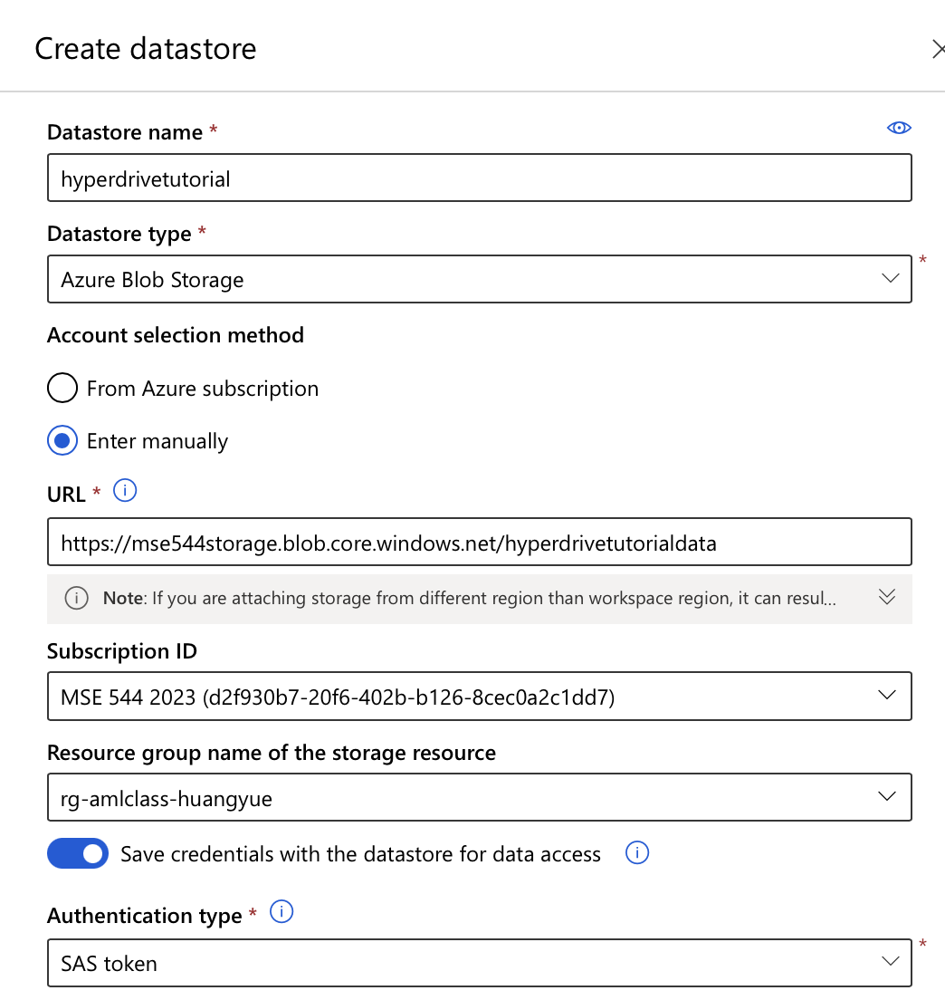

<font color="red"># TO DO: 
- Include screenshots
- Include detail/descriptions of what is happening
- Include other options not mentioned in tutorial (i.e. sampling types)
- Properly format document 
- Proof read & spell check
</font>

# MSE544-HyperDrive Experiment
## HyperDrive
HyperDrive is a machine learning package found within Azure that aids in hyperparameter tuning/optimization. Hyperparameters are the parameters initialized before training that influence how the model trains and ultimately how the finished model performs. Examples of hyperparameters include: batch size, learning rate, number of layers in the nerual network, the optimizer (e.g. Adam vs SGD), etc.\
Typically, the obejctive, when hyperparameter tuning, is to find the combination of hyperparameters that gives the best performing model. Azure has developed a package to make this discovery process much easier.  
This tutorial will walk you through how to set up and run this process. 
## Repository Background
The framework presented in this work introduces the crystal graph convolution neural networks (CGCNN), which are designed to represent periodic crystal systems and predict material properties at DFT level accuracy and propose chemical insight. Read more about this study [here](https://journals.aps.org/prl/pdf/10.1103/PhysRevLett.120.145301).  
## Dataset Introduction
A collection of 3,207 .cif crystal structures have been extracted from the "materials project" website and consolidated into an Azure data storage. <font color="red">be more detailed </font> 

-----------------------------------
## Instructions
### Part I: Set up the repository
1. Make a directory 
    ``` 
    mkdir MSE544-Hyperdrive
    ```
2. Move into the new directory
    ```
    cd MSE544-Hyperdrive
    ```
3. Clone the following repository
    ```
    git clone https://github.com/txie-93/cgcnn.git
    ```
4. Move into the "cgcnn" directory 
    ```
    cd cgcnn
    ````
5. Starting at line 20 of the 'main.py' file, add the following two lines:
    ```
    from azureml.core import Run
    run = Run.get_context()
    ```
    The 'run' variable will represent the run of your hyperdrive experiment and 'get_context' will return the current context for logging metrics. We will be looking at specifically the mean absolute error (see next step).
6. Add the following line right before the 'else' statement in line 191:
    ```
    run.log("MAE", np.float(mae_error.item()))
    ```
    This line is cruical for logging the metric (MAE) for your run.
7. Download the .yml file from Canvas and place it in the "cgcnn" directory. The .yml (sometimes seen as .yaml) file is a special file typically used for configuring environments/settings for programs. Files with this extension are intended to be human-readable.
    FUN FACT: YAML initially stood for, *Yet Another Markdown Language*
### Part II: Create an AML dataset linked to an Azure storage account 
1. Create a data store in your ML workspace by click create/datastore from the homepage of ML studio, make sure you are in your workspace for this class. 


2. Input all the information as shown in the screen shot below, and makesure you choose authentication type as SAS token (SAS aka Shared Access Signature), and copy paste SAS token ```?sv=2020-08-04&ss=b&srt=co&sp=rlitfx&se=2022-07-02T02:55:20Z&st=2022-05-01T18:55:20Z&spr=https&sig=9P04kUW8p%2BsaX%2BJEkA%2FNNuWX1f7TNpOiKr1OS6dJARM%3D```, and then hit create. By creating a datastore, you link your workspace with an created storage account that already exists. In this way, multiple users can share the same data without having to copy the data intou your own workspace, therefore save the cost of data storage.  


3. Now let's create a dataset from datastore. In your ML studio home, click "Datasets"/"Create dataset"/"From datastore" 


4. Give a name to your dataset ```materials_hyperdrive_dataset", select Dataset type as "File" and hit Next


5. In the prompt of Select or create a datastore, choose "hyperdrivetutorial" from the pull down menu (Note, since you have already link your datastore to the storage account, you should be able to select this existing one), and then choose the path to be ** and unclick "Skip data validation" hit next 


6. Double check the informaiton and hit Create


7. Now if you go back to your ML workspace home and click datasets, you will be able to see the one you just created. 


8. Click the dataset, and click explore, you can see preview the files in your dataset. 


### Part III: Build the Notebook
1. Make a jupyter notebook called "hyperdrive_experiment" 
    - make sure this notebook is in the same directory as the "main.py" python script
2. Insert a cell with the following imports
    ```
    from azureml.core import Workspace, Experiment, Environment, ScriptRunConfig, Dataset, Run
    import azureml
    from azureml.train.hyperdrive import BayesianParameterSampling
    from azureml.train.hyperdrive import normal, uniform, choice
    from azureml.core.run import Run
    from azureml.train.hyperdrive import HyperDriveConfig, PrimaryMetricGoal
    ```
    From the core tools package, we will import the standard classes for running jobs on Azure then we will import tools specific for hyperdrive to fine-tune our experiment.
3. Initialize a workspace in the next cell (be sure to enter the appropriate information)
    ```
    subscription_id = <INSERT HERE>
    resource_group  = <INSERT HERE>
    workspace_name  = <INSERT HERE>
    ws = Workspace(subscription_id, resource_group, workspace_name)
    experiment = Experiment(workspace=ws, name='hyperdrive_experiment')
    ```
    - *Workspace:* resource used for experimenting, training, and deploying machine learning models
    - *Experiment:* defines the entry point for experiments in Azure. This is nothing more than a container that holds all of the runs you have submitted 

4. Create a "dataset" variable that points to the data storage account holding the .cif files that we will use for training
    ```
    dataset = Dataset.get_by_name(ws, name='materials_hyperdrive_dataset')
    ```
    - *Dataset:* allows access to data in datastores (hosted on Azure) or from URLs that are publicly available

5. Set an environment variable using the .yml file
    ```
    cgcnn_env = Environment.from_conda_specification(name='cgcnn_env', file_path='cgcnn_env.yml')
    ```
    - *Environment:* builds a reproducible python environment for the experiments to run in

6. Configurate the base training session
    Here we are configuring our experiment, as we have done in previous tutorials.
    ```
    config = ScriptRunConfig(source_directory='./',   
                             script='main.py',       
                             compute_target='<INSERT HERE>', 
                             environment=cgcnn_env,
                             arguments=[
                                '--epochs', 5,
                                '--train-ratio', 0.6,
                                '--val-ratio', 0.2,
                                '--test-ratio', 0.2, 
                                 dataset.as_mount()]                   
                             )
    ```
    - *ScriptRunConfig:* establishes the configuration information needed (python script, compute target, ...) to run the machine learning experiment
    - *source_directory:* indicates the (working) directory our scripts can be found
    - *script:* defines the python script we want to run
    - *compute_target:* tells Azure where we want to run this experiment
    - *environment:* initiates the predefined environment needed to succesfully run this experiment
    - *arguments:* allows us to define some constant parameters that the experiment should use (i.e. ratio of data allocatted to the test, validation, and training set). Notice we also input our dataset here, which we have mounted 

7. Define the parameters you are interested in sampling
    There are three different methods in which the hyperparameter space can be sampled: \
        i. *Random sampling*: hyperparameters are randomly selected from the defined search space \
        ii. *Grid sampling*: hyperparameters are selected such that all possible combinations are explored during experimentation (computationally expensive)\
        iii. *Bayesian sampling*: hyperparameters are selected based on the outcomes of previous experiments; each subsequent run should be an improvement over the previous\
    In setting up our search space, we have the option of defining discrete or continous hyperparameter spaces where the former is initiated by "choice" and the latter can be requested via "uniform" (amongst others)
    ```
    param_sampling = BayesianParameterSampling( {
        "batch-size": choice(16, 32, 64),
        "learning-rate": uniform(0.05, 0.1),
        "optim": choice("SGD", "Adam")
    }
    )
    ```
    (See reference I. for addition details)

8. Configure the hyperdrive experiment
    ```
    hd_config = HyperDriveConfig(run_config=config,
                                 hyperparameter_sampling=param_sampling,
                                 primary_metric_name="MAE",
                                 primary_metric_goal=PrimaryMetricGoal.MINIMIZE,
                                 max_total_runs=8,
                                 max_concurrent_runs=4)
    ```
    - *HyperDriveConfig:* establishes the configuration information about the hyperparameters and relevant metrics needed to run the HyperDrive experiment
    - *run_config:* instructions on how to set up the script runs (see step 6)
    - *hyperparameter_sampling:* this is where the hyperparameter sampling space is specified, we have outlined the relevant hyperparameters and their respective spaces above in step 7
    - *primary_metric_name:* define the metric of interest (in this case, we are interested in the mean absolute error, MAE)
    - *primary_metric_goal:* decide how you want to evaluate your experiment (maximize or minimize the primary metric)
    - *max_total_runs:* specify the number of runs you would like your experiment to complete (the default is 10080!)
    - *max_concurrent_runs:* indicates the number of runs you would like to run concurrently, if a value is not specified, all runs will execute simultaneously 

9. Finally, run the experiment and monitor the progress using the printed url
    ```
    run = experiment.submit(hd_config)
    aml_url = run.get_portal_url()
    print(aml_url)
    ```

### Part III: Running the Experiment and Navigating Azure
1. When you follow the url printed in step 9 of part II, you should find a page that looks something like this:

    <ol type="A">
    <li> Pathway to the experiment we are running</li> 
    <li> Name of the current experiment - this is easily edited to something more meaningful by selecting the pencil symbol</li>
    <li> Tab showing the various runs that will be submitted during the experiment</li>
    </ol>
2. Select the "child runs" tab to view the following page:

    <ol type="A">
    <li> Lists the subsequent runs within my experiment and provides relevant information such as: name of the run, status (pending, queued, complete), mean absolute error (MAE), duration of the run, batch size, time submitted. Notice the small arrow next to MAE, which indicates that I have sorted my runs based on the resulting MAE value. </li>
    <li> Visualization of the MAE for each run as they progressed</li>
    <li> Chart correlating the hyperparameters selected for each run and the calculated MAE </li>
        - select the drop-down menu right above this plot to visualize the data in different dimensions
    </ol>
3. Select one of your child runs to further investigate by clicking on the display name

We find a lot of useful information here 
    <ol type="A">
    <li>Here are the hyperparameters that were selected and used for this run, this is variable for every child run in this experiment </li> 
    <li>An overview of the changing MAE is listed so we can easily see how it changed during the run </li>
    <li>Here are a list of the arguments that are given to our script, notice how are sampled hyperparameters from a. are used here an input </li>
    </ol>
    
# References
I. [Hyperparameter tuning models using Azure Machine Learning](https://docs.microsoft.com/en-us/azure/machine-learning/how-to-tune-hyperparameters#define-search-space)
